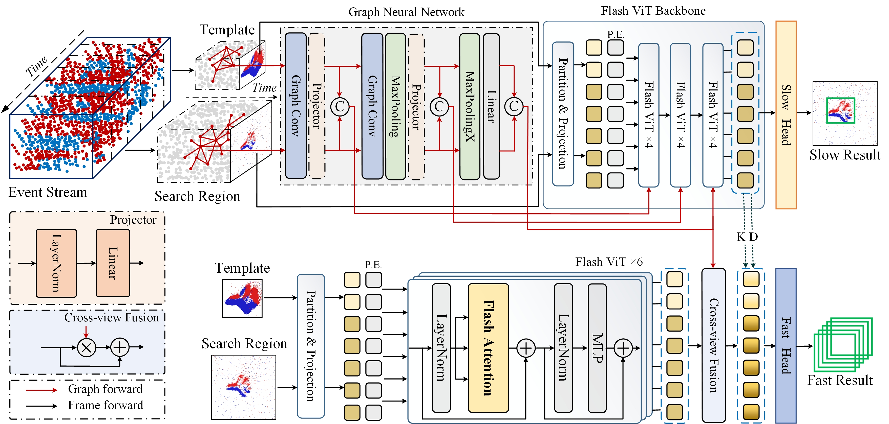

# :dart: Abstract 
Existing tracking algorithms typically rely on low-frame-rate RGB cameras coupled with computationally intensive deep neural network architectures to achieve effective tracking. However, such frame-based methods inherently face challenges in achieving low-latency performance and often fail in resource-constrained environments. Visual object tracking using bio-inspired event cameras has emerged as a promising research direction in recent years, offering distinct advantages for low-latency applications. In this paper, we propose a novel Slow-Fast Tracking paradigm that flexibly adapts to different operational requirements, termed SFTrack. The proposed framework supports two complementary modes, i.e., a high-precision slow tracker for scenarios with sufficient computational resources, and an efficient fast tracker tailored for latency-aware, resource-constrained environments. Specifically, our framework first performs graph-based representation learning from high-temporal-resolution event streams, and then integrates the learned graph-structured information into two FlashAttention-based vision backbones, yielding the slow and fast trackers, respectively. The fast tracker achieves low latency through a lightweight network design and by producing multiple bounding box outputs in a single forward pass. Finally, we seamlessly combine both trackers via supervised fine-tuning and further enhance the fast tracker’s performance through a knowledge distillation strategy. Extensive experiments on public benchmarks, including FE240, COESOT, and EventVOT, demonstrate the effectiveness and efficiency of our proposed method across different real-world scenarios.

# :hammer: Environment 

**A Slow-Fast framework for Event Stream-based Visual Object Tracking.**

<p align="center">
  
</p>

Install env
```
conda create -n sftrack python=3.10
conda activate sftrack
bash install.sh

wget https://github.com/Dao-AILab/flash-attention/releases/download/v2.7.3/flash_attn-2.7.3+cu11torch2.3cxx11abiFALSE-cp310-cp310-linux_x86_64.whl
pip install flash_attn-2.7.3+cu11torch2.3cxx11abiFALSE-cp310-cp310-linux_x86_64.whl
pip install torch-scatter torch-sparse torch-cluster torch-spline-conv -f https://data.pyg.org/whl/torch-2.3.0+cu118.html
pip install torch-geometric==1.7.2
```

You can modify paths by editing these files
```
Stage1/lib/train/admin/local.py  # paths about training
Stage1/lib/test/evaluation/local.py  # paths about testing

Stage2/lib/train/admin/local.py  # paths about training
Stage2/lib/test/evaluation/local.py  # paths about testing
```

## Train & Test
```
# Stage1
bash train.sh 
bash test.sh

# Stage2
bash train.sh 
bash test.sh
```

Download pre-trained [MAE ViT-Base weights](https://dl.fbaipublicfiles.com/mae/pretrain/mae_pretrain_vit_base.pth)and put it under `$Stage1/pretrained_models` and `$Stage2/pretrained_models`

In the first training stage, Slow_ep0050.pth.tar and Fast_ep0050.pth.tar are obtained separately. (You can choose to train the Slow Tracker or the Fast Tracker in "Stage1/experiments/sftrack/**.yaml")

Then, put Slow_ep0050.pth.tar and Fast_ep0050.pth.tar under `$Stage2/pretrained_models` for supervised fine-tuning in the second training stage.

### Test FLOPs, and Speed
*Note:* The speeds reported in our paper were tested on a single RTX 4090 GPU.

# :dvd: Dataset 

The dataset directory (using the EventVOT dataset as an example) should be organized in the following structure:
```Shell
├── EventVOT dataset
    ├── train
        ├── recording_2022-10-10_17-28-38
            ├── img
            ├── recording_2022-10-10_17-28-38_bin
            ├── groundtruth.txt
            ├── absent.txt
        ├── ... 
    ├── test
        ├── recording_2022-10-10_17-28-24
            ├── img
            ├── recording_2022-10-10_17-28-24_bin
            ├── groundtruth.txt
            ├── absent.txt
        ├── ...
```
